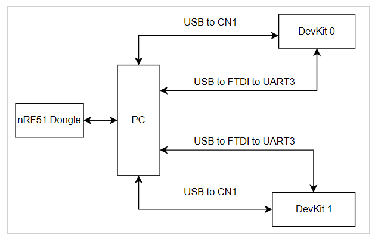

# ble_auto_testing

This project is used to automatically run BLE applications remotely, at the same time sniff the BLE packets, then save to a file, and finally parse the file to verify TIFS and other parameters in the future.

The related project is [pcapng_parser](https://github.com/yc-adi/pcapng_parser).

## Usage
### Hardware setup 
In this test, two MAX32655 DevKit boards are used. 

Following the instructions in the README of project [VSCode-Maxim](https://github.com/Analog-Devices-MSDK/VSCode-Maxim), program the [BLE5_ctr project](https://github.com/Analog-Devices-MSDK/msdk/tree/main/Examples/MAX32655/BLE5_ctr) into the two DevKit boards. 

Then set up the test as the following figure shows.




### Find the devices on a Ubuntu machine
**NOTE**  
The sequence of powering up the board and plug in the USB cables will effect the ttyUSB*.    
Suggest sequence:  
Power up DevKit 0 -> /dev/ttyUSB0  
Plug in DevKit 0 UART3 cable -> /dev/ttyUSB1  
Power up DevKit 1 -> /dev/ttyUSB2  
Plug in DevKit 1 UART3 cable -> /dev/ttyUSB3  

### Local test

### Windows
In a Windows terminal, cd the source code folder.
```
.\venv\Scripts\activate
python -m ble-auto-testing -h
```
In the virtual environment, run the test.
```
python -m ble-auto-testing --interface COM4-None --device "" --brd0-addr 00:11:22:33:44:11 --brd1-addr 00:11:22:33:44:12 --sp0 COM9 --sp1 COM10 --time 30 --tshark "C:\Program Files\Wireshark\tshark.exe" 
```

### Linux

```
/home/ying-cai/Workspace/ble_auto_testing/venv/bin/python /home/ying-cai/Workspace/ble_auto_testing/ble_auto_testing.py --interface /dev/ttyACM0-None --device "" --brd0-addr 00:11:22:33:44:11 --brd1-addr 00:11:22:33:44:12 --sp0 /dev/ttyUSB1 --sp1 /dev/ttyUSB3 --time 30 --tshark /usr/bin/tshark
```


