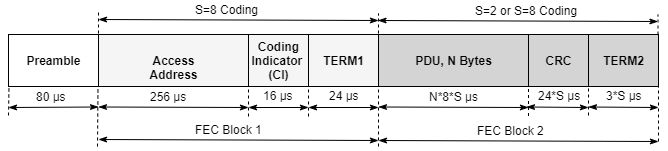

# pcapng file parser

The project is used to parse the Wireshark with nRF Sniffer saved pcapng files.  

## Usage
```python
# in Windows
.\venv\Scripts\activate.bat
python -m pcapng_file_parser <full path and name for pcapng file>
# example
python -m pcapng_file_parser .\Examples\fit_01.pcapng
```
If all TIFS measurements are within 150 us +/- 2 us, the program will output "PASS". Or it will output "FAIL".

```python
# invalid case 1
python -m pcapng_file_parser
Please give the pcapng file name with full path.

# invalid case 2
python -m pcapng_file_parser .\Examples\fit_01.pcapngx
File ".\Examples\fit_01.pcapngx" does not exist.
```

## How the sniffer works
```python
class SnifferCollector(Notifications.Notifier):
class Sniffer(threading.Thread, SnifferCollector.SnifferCollector):
sniffer = Sniffer.Sniffer(interface, baudrate)
sniffer.subscribe("NEW_BLE_PACKET", new_packet)
```

This subscribes "NEW_BLE_PACKET" with new_packet(notification) callback.

In the callback function, it retreives the packet data and save to a PCAP packet which can be used for Wireshark or saved in a PCAP file.
```python
packet = notification.msg["packet"]
Pcap.create_packet(p, packet.time)  # create a PCAP packet
```

In the thread of sniffer,
```python
def run(self):
    try:
        self._setup()
        self.runSniffer()
            # in runSniffer()
            self._continuouslyPipe()
                # super loop here
                while not self._exit:
                    packet = self._packetReader.getPacket(timeout=12)
                        packetList = self.decodeFromSLIP(timeout)
                        packet = Packet(packetList)
                            self.readPayload(packetList)
                        self.handlePacketCompatibility(packet)
                            self.convertPacketListProtoVer2(packet)
                            # Convert time-stamp to End to Start delta
                        self.handlePacketHistory(packet)
                            # save the last packet so that TIFS can be calculated
                    
                    self._processBLEPacket(packet)  
                    # IMPORTANT! Time is saved there!
                    if packet.protover >= PROTOVER_V3:
                        if self._last_time is None:
                            # Timestamp from Host
                            packet.time = time.time()
                        else:
                            # Timestamp using reference and packet timestamp diff
                            if packet.timestamp < self._last_timestamp:
                                time_diff = (1 << 32) - (self._last_timestamp - packet.timestamp)
                            else:
                                time_diff = (packet.timestamp - self._last_timestamp)

                            packet.time = self._last_time + (time_diff / 1_000_000)

                            self._last_time = packet.time
                            self._last_timestamp = packet.timestamp
                    else:
                        # Timestamp from Host
                        packet.time = time.time()

``` 


## How to calculate the whole packet time
The packet time is not from measurement but from calculation like time = (packet length) x (time for each byte).  
```python
    def getPacketTime(self, packet):
        ble_payload_length = self.lastReceivedPacket.payloadLength - BLE_HEADER_LENGTH  # 10

        if packet.phy == PHY_1M:
            return 8 * (1 + ble_payload_length)
        elif packet.phy == PHY_2M:
            return 4 * (2 + ble_payload_length)
        elif packet.phy == PHY_CODED:
            # blePacket is not assigned if not packet is "OK" (CRC error)
            ci = packet.packetList[BLEPACKET_POS + 4]
            fec2_block_len = ble_payload_length - 4 - 1
            fec1_block_us = 80 + 256 + 16 + 24
            if ci == PHY_CODED_CI_S8:
                return fec1_block_us + 64 * fec2_block_len + 24
            elif ci == PHY_CODED_CI_S2:
                return fec1_block_us + 16 * fec2_block_len + 6
        # Unknown PHY or Coding Indicator
        return 0
```

<center>Figure: Packet format for the LE coded PHY</center>

## How to get the T_IFS
On the Sniffer side, the time_delta is saved as timestamp.
```python
time_delta = 0
if self.lastReceivedTimestampPacket is not None and self.lastReceivedTimestampPacket.valid:
    time_delta = (packet.timestamp -
                  (self.lastReceivedTimestampPacket.timestamp +
                   self.getPacketTime(self.lastReceivedTimestampPacket)))

time_delta = toLittleEndian(time_delta, 4)
packet.packetList[TIMESTAMP_POS  ] = time_delta[0]
packet.packetList[TIMESTAMP_POS+1] = time_delta[1]
packet.packetList[TIMESTAMP_POS+2] = time_delta[2]
packet.packetList[TIMESTAMP_POS+3] = time_delta[3]
```

On the parser side, the timestamp is parsed as:
```python
    def readPayload(self, packetList):
        ...
        self.timestamp = parseLittleEndian(packetList[TIMESTAMP_POS:TIMESTAMP_POS+4])
```
And for Wireshark display, the packet time is calculated from the last time and delta time as mentioned before.

## How pcapnp file parser works
Open the saved pcapng file.  
Create a PacketReader object.  
Use a FileScanner object scanner to scan the opened file.  
Reach each block from the scanner.  
The packet data are retrieved from block.packet_data.  
Each packet is parsed by following process.  

```python
    packet_list = block.packet_data[1:]
    packet = Packet.Packet(packet_list, is_parser=True)
        self.readPayload(packetList)
            self.timestamp = parseLittleEndian(packetList[TIMESTAMP_POS:TIMESTAMP_POS+4])  # epoch time in secs
            self.blePacket = BlePacket(packet_type, packetList[BLEPACKET_POS:], self.phy, pcapng_parser=self.is_parser)
    packet_reader.handlePacketCompatibility(packet)
    packet_reader.handlePacketHistory(packet)
```

## When to check T_ifs
| Cases | Last PDU Type | Current PDU Type |
| :---  | :---          | :---             |
|1 | ADV_IND | SCAN_REQ |
|2 | SCAN_REQ | SCAN_RSP |
